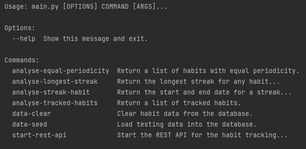
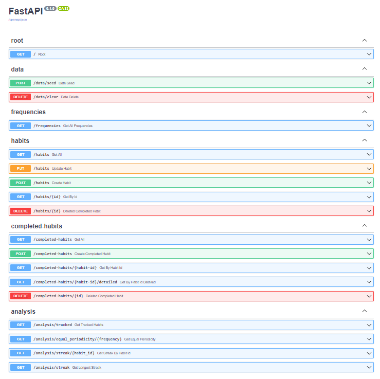
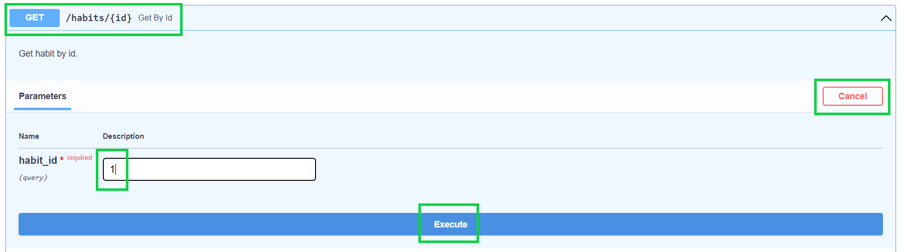
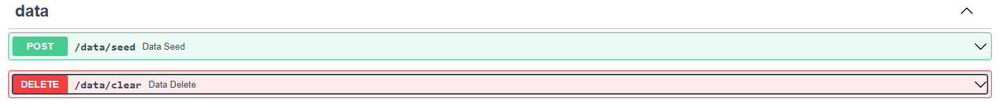
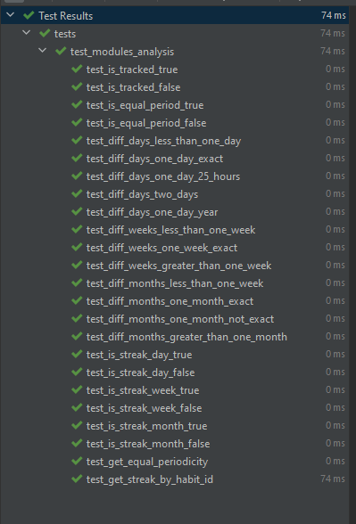

# Habit Tracking Application

## Table of contents

[1. Overview](#overview)

[2. Running the project](#running-the-project)

&nbsp;&nbsp;&nbsp;&nbsp;[2.1 Prerequisites](#prerequisites)

&nbsp;&nbsp;&nbsp;&nbsp;[2.2 Installing the project](#installation)

[3. Using the project](#using)

&nbsp;&nbsp;&nbsp;&nbsp;[3.1 Running the cli](#running-cli)

&nbsp;&nbsp;&nbsp;&nbsp;[3.2 Start Rest API (Swagger UI)](#restapi)

[4. Testing](#testing)

[5. Calculation rules for a Streak](#rules)

[6. Technology choices](#technology)

[7. Bibliography](#bibliography)

<div id='overview'/>

## 1. Overview <a name="overview"></a>

Everybody wants to stop unhealthy habits and create good habits in its place. They are turning to technology for assistance to achieve this. I was tasked to create a backend for a habit tracking application that will assist users to reach their goals.

<div id='running-the-project'/>

## 2. Running the project

<div id='prerequisites'/>

### 2.1 Prerequisites

**Python 3.7** or later. (Python 3.10.3 was used for development). Download the latest version [here](https://www.python.org/downloads/)

<div id='installation'/>

### 2.2 Installing the project

- Clone the repository locally
- Open CommandPrompt on Windows or Terminal on Mac to the cloned folder
- Go to the root folder (**OOFPP-Habits-Phase3**) of the project where you will see a _setup.py_ file
- Run the following command

  ```
  pip install .
  ```

- If you see `Successfully installed OOFPP-Habits-Phase3-1.0` the application is ready to be used.

<div id='using'/>

## 3. Using the project

<div id='running-cli'/>

### 3.1 Running the _cli_

From the _CommandPrompt_ or _Terminal_ window, go to the _habits_backend_ folder (**OOFPP-Habits-Phase3**) of the application.
Run the following command to see the _cli_ help menu.

```
python main.py --help
```

You should see the following help menu



**To load or clear the test data, you can run the following commands**

```
python main.py data-clear
python main.py data-seed
```

**Analysis cli commands**

_Show all the tracked habits_ (Habit that was completed at least once. The testing data has habits that was not completed.)

```
python main.py analyse-tracked-habits
```

_Habits with the same periodicity_ ('daily','weekly','monthly')

```
python analyse-equal-periodicity --frequency daily
```

_Longest streak for a specific habit_

```
python main.py analyse-streak-habit --habit_id 1
```

_Longest streak for any habit_

```
python main.py analyse-longest-streak
```

<div id='restapi' />

### 3.2 Start Rest API (Swagger UI)

From the _CommandPrompt_ or _Terminal_ window, go to the _habits_backend_ folder (**OOFPP-Habits-Phase3**) of the application.

Run the following command to start the REST API.

```
python main.py start-rest-api
```

To see the OpenAPI documentation browse to
http://127.0.0.1:8000/docs or http://localhost:8000/docs



**Using the Swagger interface**

- Click on the color coded method (e.g. GET /habits/{id} to open up the interface)
- Click on the _Try it out_ button
- If there are details required, fill it in e.g. habit_id
- Click on the blue _Execute_ button



You can use the _seed_ and _clear_ methods under data section to load/clear testing data



<div id='testing' />

## 4. Testing

Tests was created using _pytest_.

To run the tests, follow the following steps

- Open a CommandPrompt or Terminal window
- Go to the **tests** folder in the root (**OOFPP-Habits-Phase3**) of the application
- To execute all the analysis tests, run the following command

  ```
  pytest test_modules_analysis.py
  ```

  **View running tests from Command Prompt**

  

  **View running tests in the IDE**

  

- To execute all the _cli_ tests, run the following command

  ```
  pytest test_main.py
  ```

- To run individual tests, run the following commands
  ```
  pytest test_modules_analysis.py::test_is_tracked_true
  pytest test_modules_analysis.py::test_is_tracked_false
  pytest test_modules_analysis.py::test_is_equal_period_true
  pytest test_modules_analysis.py::test_is_equal_period_false
  ```

<div id='rules' />

## 5. Calculation rules for a Streak

- Day:
  - Less than or equal to 1 day is counted as a day. (e.g. "2022-04-27T14:17:45" to "2022-04-28T15:57:21" is one day)
  - Hours, minutes and seconds are ignored.
  - If the day count is more than 1, the streak was broken
- Week:
  - Less than or equal to 7 days is treated as a week.
  - Hours, minutes and seconds are ignored.
  - If the week count is more than 1, the streak was broken
- Month
  - Less than or equal to a month is treated as a month
  - Days, hours, minutes and seconds are ignored.
  - If the year count is more than 1, the streak was broken

<div id='technology' />

## 6. Technology choices

- Python version 3.10.3 _(Project requirement to use 3.7 or later.)_
- PyCharm 2022.1.1 _(Popular IDE / source-code editor that runs on Windows, Linux and macOS. I found that it works better than Visual Studio Code for python development.)_
- sqlite3 _(It is a library that provides lightweight disk-based database to persist the data.)_
- pytest _(Framework for writing tests.)_
- FastAPI _(Framework for building APIs with python. This will provide an alternative for the CLI.)_
- click _(Python library for creating command line interfaces.)_
- Pylint _(Linting tool that checks for coding errors and enforce coding standards.)_
- Swagger UI _(Interactive exploration to call and test your API from the browser.)_
- SQLAlchemy _(Accessing data stored in the database.)_
- pydantic _(Data parsing and validation.)_

<div id='bibliography' />

## 7. Bibliography

1. n.a. (n.d). Google Python Style Guide – Naming https://google.github.io/styleguide/pyguide.html#316-naming
2. Lutz, M (2013). OOP: The Big Picture, Learning Python 5th Edition. O’Reilly
3. Marcus, S (2021, July 16). Test Driven Development with pytest https://stackabuse.com/test-driven-development-with-pytest/
4. n.a. (n.d). Zalando RESTful API and Event Guidelines
   https://opensource.zalando.com/restful-api-guidelines/
5. n.a. (n.d). FastAPI - SQL (Relational) Databases
   https://fastapi.tiangolo.com/tutorial/sql-databases/
6. n.a. (n.d). click
   https://click.palletsprojects.com/en/8.1.x/
7. Martin, Robert C (2012, August 13) – The Clean Architecture
   https://blog.cleancoder.com/uncle-bob/2012/08/13/the-clean-architecture.html
